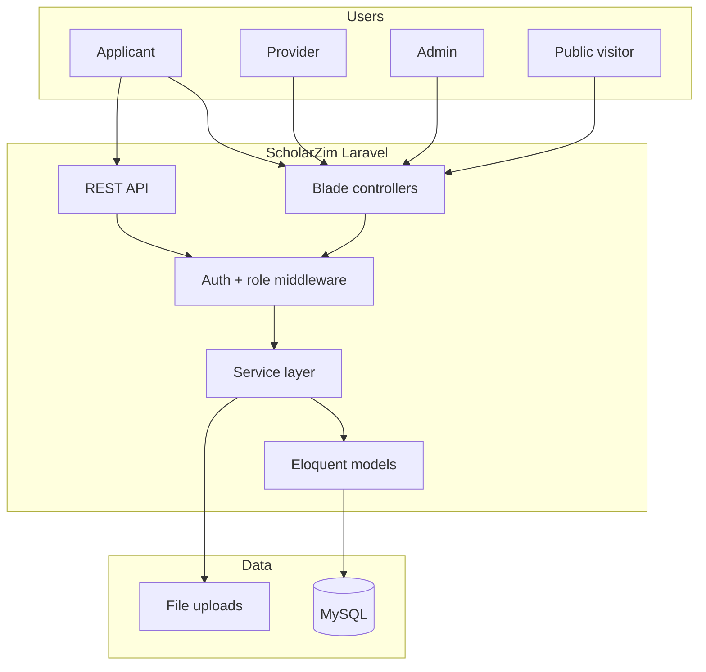
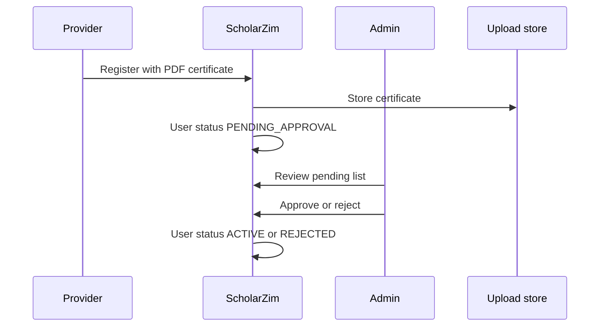
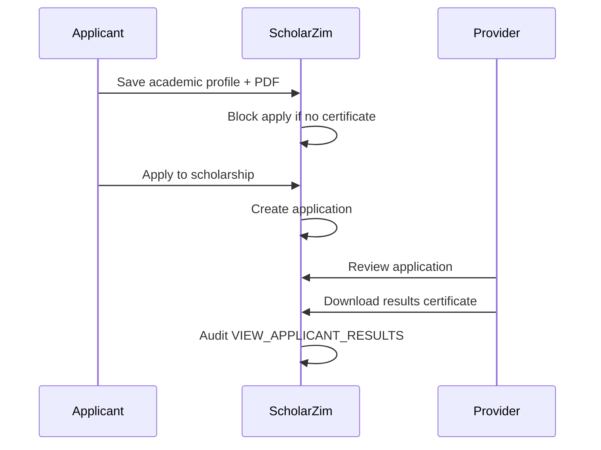

# ScholarZim Architecture

## System context

ScholarZim connects **applicants** (students), **providers** (scholarship organisations), and **platform administrators** through a single web application. Public users browse scholarships without logging in; authenticated users access role-specific dashboards and workflows.



## Technology stack

| Layer | Technology |
|-------|------------|
| Runtime | PHP 8.1+ (developed against 8.4) |
| Framework | Laravel 10 |
| UI | Blade, Bootstrap 5, Vite (ScholarZim's own CSS/JS only) |
| Security | Laravel auth (form login, bcrypt, role middleware), CSRF, per-record ownership checks in the service layer |
| Persistence | Eloquent ORM, MySQL 8, Laravel migrations |
| Background work | Database queue (mail and notifications), Laravel scheduler (two daily jobs) |
| Reports | dompdf (PDF), PhpSpreadsheet (Excel) |
| Email | Laravel Mail — Mailgun HTTP API in production, MailHog under local Docker, `log` locally without Docker |

## Runtime processes

Three processes, all supervised inside the one container:

| Process | Responsibility |
|---------|----------------|
| nginx + PHP-FPM | Serves requests |
| `schedule:run` tick | Fires the daily alert and reminder jobs |
| `queue:work` | Drains queued mail and notifications |

The queue is not optional. Approving a listing fans a notification out to every matching
applicant; doing that inside the request made the administrator wait on one SMTP round trip
per recipient. With `QUEUE_CONNECTION=database` the request returns immediately and the
worker delivers — which also means **nothing is delivered without a worker running**.

## Layered design

```
Controller / API  →  Service  →  Eloquent model  →  MySQL
```

- **Controllers** (`app/Http/Controllers`) — server-rendered pages, form handling, redirects.
- **API** (`app/Http/Controllers/Api`) — JSON endpoints for public catalog and applicant features.
- **Services** (`app/Services`) — business rules, audit logging, file storage, reports.
- **Models** (`app/Models`) — `User`, `Role`, `Opportunity`, `Application`, `ApplicantProfile`, `ProviderProfile`, `Notification`, `AuditLog`, etc.
- **Console commands** (`app/Console/Commands`) — the scheduled deadline and profile reminder jobs.
- **Support** (`app/Support`) — status/type constants shared across the layers.

## Core domain flows

### Provider verification



### Applicant results certificate and apply gate



### ScholarFit recommendations

Rule-based scoring in `app/Services/ScholarFit/ScholarFitEngine.php` matches applicant profile fields (education level, field of study, country) against opportunity criteria. Results appear on the applicant dashboard and via `/api/applicant/recommendations`.

## Database strategy

- **Schema source of truth:** `database/migrations/` — one migration per table, each reversible.
- **Development / demo:** `php artisan migrate --seed` builds the schema and the demo dataset.
- **Production:** migrations run on container start; credentials and mail come from environment variables and demo seeding is off.
- **History note:** the schema was carried over from the previous Spring implementation's Flyway migrations (V1–V13) and consolidated — column names and constraints are unchanged, so the same MySQL database backs either application.

## File storage

Uploads (provider registration certificates, applicant results PDFs, optional application documents) are stored on the `local` disk under `storage/app`. Nothing under `storage/` is web-reachable; downloads go through authenticated controllers (`FileDownloadController`), which re-check the caller's role before streaming a file. In Docker, `storage/app` is a mounted volume so uploads survive a redeploy.

## Deployment profiles

| `APP_ENV` | Purpose |
|-----------|---------|
| local | Local development; config/route/view caches are left off |
| production | Production — caches warmed on boot, `SCHOLARZIM_DEMO_SEED=false` |
| testing | Automated tests (SQLite in-memory, see `phpunit.xml`) |

Demo seeding is a separate switch (`SCHOLARZIM_DEMO_SEED=true`) rather than an environment, so a viva build can seed without running in development mode.

## Future work (out of scope)

- Monetization / billing
- Mobile native client
