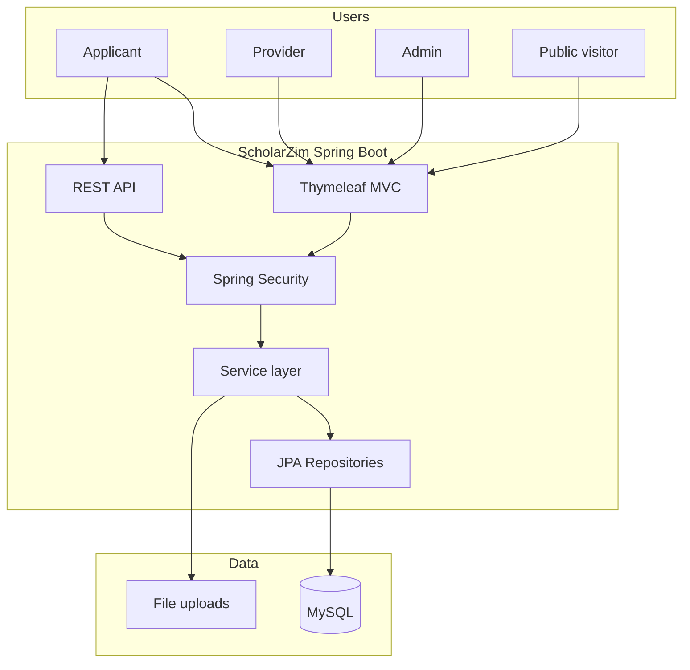
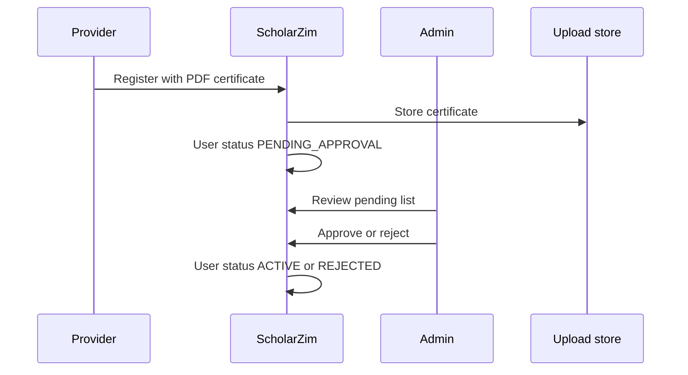
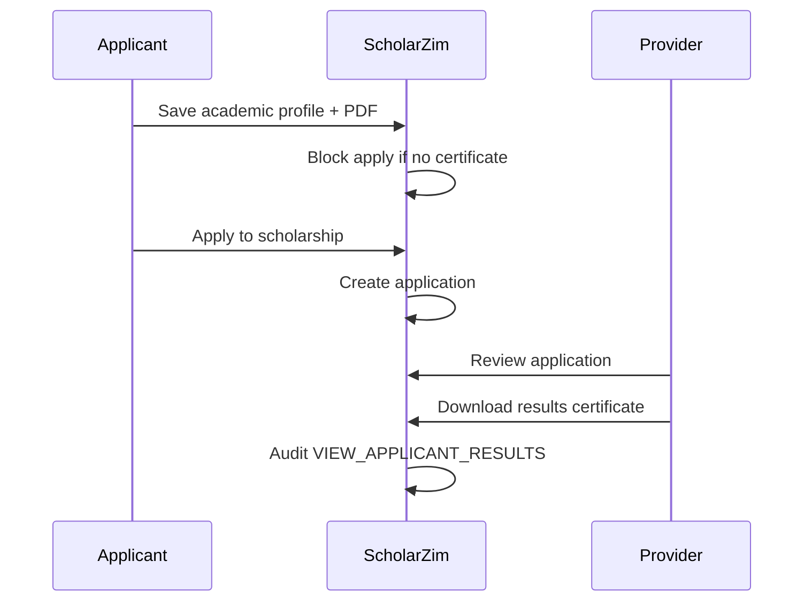

# ScholarZim Architecture

## System context

ScholarZim connects **applicants** (students), **providers** (scholarship organisations), and **platform administrators** through a single web application. Public users browse scholarships without logging in; authenticated users access role-specific dashboards and workflows.



## Technology stack

| Layer | Technology |
|-------|------------|
| Runtime | Java 21 |
| Framework | Spring Boot 3.5 |
| UI | Thymeleaf, Bootstrap 5 |
| Security | Spring Security (form login, BCrypt, role-based access) |
| Persistence | Spring Data JPA, MySQL 8, Flyway migrations |
| API docs | springdoc OpenAPI (dev/demo only) |
| Email | JavaMailSender (Mailhog locally, SMTP in production) |

## Layered design

```
Controller / API  →  Service (interface + impl)  →  Repository  →  Entity
```

- **Controllers** (`com.scholarzim.controller`) — server-rendered pages, form handling, redirects.
- **API** (`com.scholarzim.api`) — JSON endpoints for public catalog and applicant features.
- **Services** — business rules, transactions, audit logging, file storage.
- **Repositories** — Spring Data JPA access to MySQL.
- **Entities** — `User`, `Role`, `Opportunity`, `Application`, `ApplicantProfile`, `ProviderProfile`, `Notification`, `AuditLog`, etc.

## Core domain flows

### Provider verification



### Applicant results certificate and apply gate



### ScholarFit recommendations

Rule-based scoring in `RecommendationServiceImpl` matches applicant profile fields (education level, field of study, country) against opportunity criteria. Results appear on the applicant dashboard and via `/api/applicant/recommendations`.

## Database strategy

- **Development / demo:** Hibernate `ddl-auto=update` plus Flyway `baseline-on-migrate=true` for incremental migrations V2–V5.
- **Production:** `ddl-auto=validate`; credentials and mail from environment variables.
- **Migrations:** `src/main/resources/db/migration/` — platform extensions, security columns, provider verification, applicant results certificate.

See [db/migration/README.md](../src/main/resources/db/migration/README.md).

## File storage

Uploads (provider registration certificates, applicant results PDFs, optional application documents) are stored on the local filesystem under `scholarzim.upload.dir`. Files are **not** served from `/uploads/**`; downloads go through authenticated controllers (`FileDownloadController`, `AdminController`).

## Deployment profiles

| Profile | Purpose |
|---------|---------|
| default | Local development |
| demo | Viva/demo with seeded data |
| prod | Production (no demo seed, env-based config) |
| test | Automated tests (H2 in-memory) |

## Future work (out of scope)

- Real SMS gateway integration
- Monetization / billing
- Full REST API parity with MVC
- Mobile native client
